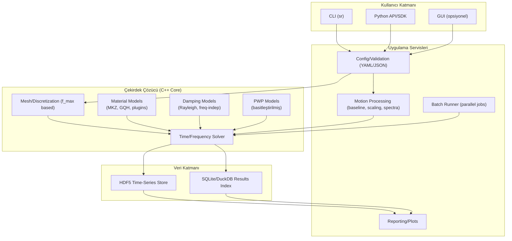
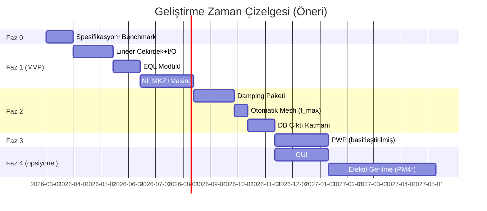

# 1D Düşey SH-Dalga Yayılımı ve Tabakalı Zemin Doğrusal Olmayan Yerel Zemin Tepkisi Analizi İçin Deepsoil-Benzeri Yazılım Tasarımı

## Yönetici Özeti

Bu rapor, 1D (düşey doğrultuda) yatay kesme dalgası (SH) yayılımı üzerinden tabakalı zemin kolonlarında **doğrusal**, **eşdeğer-doğrusal (equivalent-linear)** ve **doğrusal olmayan (nonlinear)** yerel zemin tepkisi (site response) analizlerini yapabilen, **DEEPSOIL-benzeri** bir yazılımın geliştirilmesi için teknik kapsamı, fiziksel/konstitutif model gereksinimlerini, sayısal yöntemleri, veri formatlarını, yazılım mimarisini, doğrulama-validasyon yaklaşımını ve ayrıntılı bir geliştirme yol haritasını sunar.

Google Drive taramasında (kullanıcı paylaşımları içinde) özellikle **DEEPSOIL v7.1 User Manual (2024-12-05)** dokümanı, **damping formülasyonlarına** odaklı bir doktora tezi ve **zaman adımı/sönümleme kaynaklı nümerik yanlılıkların** 1D–2D–3D kıyaslarında nasıl rol oynayabileceğini tartışan iç dokümanlar bulundu. DEEPSOIL’in hedeflediği çekirdek yetenekler; 1D doğrusal/doğrusal-olmayan zaman tanım alanı analizleri (pore pressure generation opsiyonlu), eşdeğer-doğrusal frekans tanım alanı analizleri (convolution/deconvolution), zengin motion-processing araçları, otomatik tabaka bölümlendirme (f_max tabanlı) ve çıktının ilişkisel veritabanında saklanması olarak özetlenebilir. fileciteturn7file0L326-L331 fileciteturn7file0L465-L472

Bu hedeflere ulaşmak için önerilen yaklaşım, **yüksek-performanslı çekirdek çözücüyü (C++/Fortran opsiyonlu)**; **Python tabanlı CLI/SDK** ve isteğe bağlı **GUI** ile birleştiren **modüler** bir mimaridir. Yazılımın “bilimsel doğruluk” omurgası; (i) ayrıklaştırma ve zaman integrasyonu (Newmark-β ailesi gibi), (ii) küçük şekil değiştirme (viscous) sönümü için Rayleigh’in sınırlılıklarını azaltan yaklaşımlar, (iii) histeretik sönüm ve Masing-tabanlı boşalma/yeniden-yükleme kurallarının gerçek damping eğrileriyle uyumu ve (iv) basitleştirilmiş PWP üretimi + tam-kuplajlı efektif gerilme (PM4Sand/PM4Silt gibi) seçeneklerini kapsayacak şekilde kademeli olarak genişletilmelidir. fileciteturn8file1L525-L567 fileciteturn8file1L610-L622 citeturn0search13 citeturn0search14

MVP (minimum viable product) için “DEEPSOIL-benzeri” hedef, öncelikle **doğrusal + equivalent-linear + nonlinear total-stress histeretik** (MKZ/GQH) çekirdeği; ardından **PWP üretimi (basitleştirilmiş)**; sonrasında **PM4Sand/PM4Silt ile efektif gerilme** ve ileri düzey validasyon/benchmark genişletmeleri şeklinde fazlandırılmalıdır. fileciteturn7file0L62-L76 citeturn0search1 citeturn0search10

## Proje kapsamı, hedefler ve varsayımlar

### Kapsam ve hedefler

Hedef yazılım, 1D tabakalı zemin kolonunda düşey yayılan SH dalgası varsayımıyla aşağıdaki analiz sınıflarını desteklemelidir:

- **Doğrusal analiz** (time domain ve/veya frequency domain): tabaka bazında sabit G ve sönüm (D veya ξ) ile çözüm.  
- **Eşdeğer-doğrusal (equivalent-linear) frekans alanı analizi**: iteratif olarak tabaka-başına “eşdeğer” G ve ξ güncelleyerek SHAKE-tipi yaklaşımı taklit eder; DEEPSOIL bunu “equivalent linear frequency domain analyses including convolution and deconvolution” olarak açıkça sınıflar. fileciteturn7file0L326-L331  
- **Doğrusal olmayan (nonlinear) zaman alanı analizi**: histeretik davranış + küçük-şekil viscous sönüm opsiyonları; DEEPSOIL, nonlinear time domain analizi PWP’siz ve PWP’li olarak sunar. fileciteturn7file0L326-L331  
- **Pore-water pressure (PWP) üretimi ve sönümlenmesi**: DEEPSOIL’de Dobry/Matasovic (kum), Matasovic–Vucetic (killer), GMP, generalized energy-based ve Park-Ahn gibi modeller ile dissipation seçeneği bulunduğu görülür. fileciteturn7file0L69-L76  
- **Batch-mode ve çoklu hareket yönetimi** (çoklu kayıt, rastgeleleştirilmiş profil realizasyonları): DEEPSOIL v7 ile profil alt-bölümlendirme (f_max temelli) ve Vs/kalınlık/dinamik-eğri randomization yetenekleri vurgulanır. fileciteturn7file0L467-L470  
- **İlişkisel veri tabanı çıktısı**: DEEPSOIL v7 “relational database format” ile büyük çıktıların etkin çekilmesini hedefler; benzer bir tasarım, büyük kampanya çalışmalarında kritik olur. fileciteturn7file0L471-L472

Kapsamı genişletmek için (özellikle ileri seviye efektif gerilme / sıvılaşma):

- **PM4Sand ve PM4Silt sınıfı** modeller (efektif gerilme tabanlı, cyclic mobility, ru gelişimi, dissipation) opsiyonel “v2/v3” hedef olarak planlanmalı; OpenSees ekosisteminde PM4Sand için resmi kullanıcı dokümantasyonu ve PEER doğrulama-validasyon raporu mevcuttur. citeturn0search10turn0search6  
- OpenSees örnekleri, efektif gerilme site response’ta **u-p (displacement + pore pressure DOF)** elemanları ve **Lysmer–Kuhlemeyer dashpot** taban koşullarını açıkça kullanır. citeturn0search13

### Varsayımlar

Bu raporda aşağıdaki kritik varsayımlar **belirtilmemiş** kabul edilmiştir (tasarımda açık karar gerektirir):

- Hedef kullanıcı tabanı (akademik vs ticari mühendislik; yerel yönetmelik odaklı vs genel).  
- Hedef platform (Windows-only GUI mi, yoksa Linux/macOS + container öncelikli mi).  
- Gerçek-zaman gereksinimi (near-real-time saha uygulaması mı, yoksa offline analiz mi).  
- IP/dağıtım stratejisi (tam açık kaynak mı, “core open + enterprise eklenti” mi).  
- Doğrudan DEEPSOIL proje dosyası uyumu (tam import/export mı, yoksa dönüştürücü mü).  

### Türkiye bağlamı ve standartlar

Yerel projelerde PWP/sıvılaşma derinliği ve model parametrelerinin “fiziksel karşılığı” tartışmaları pratikte kritik olabilir. İç dokümanlarda, **TBDY 2018** ve **Türkiye Kıyı ve Liman Yapıları Yönetmeliği (TKLYY)** çerçevesinde bazı uygulamalarda sıvılaşmanın “tipik” olarak ~20 m ile ilişkilendirilmesi ve PWP modellemesinin dikkatle ele alınması gerektiği vurgulanmaktadır. fileciteturn9file6L6-L8 fileciteturn9file8L6-L12  
TBDY 2018’in Resmî Gazete’de yayımlandığına ilişkin ikincil bir resmi-duyuru kaynağı da mevcuttur. citeturn0search0

## Modelleme çekirdeği: fizik, konstitutif modeller, damping ve PWP

### Temel fizik ve 1D varsayımı

1D yerel zemin tepkisi, yatay yönde parçacık hareketi ve düşey yönde yayılım gösteren SH dalgası varsayımıyla; tabakalı ortamın kütle–rijitlik–sönüm (M–K–C) temsilinde çözülen bir dinamik denge denklemine indirgenir. Bu yaklaşım (çok serbestlik dereceli lumped model veya 1D FE) literatürde standart olup; UIUC/DEEPSOIL çizgisinde Newmark-β ile zaman adımında çözüm vurgulanır. fileciteturn8file1L507-L524

### Doğrusal ve eşdeğer-doğrusal (EQL) modeller

Eşdeğer-doğrusal yöntem, düzensiz deprem hareketine rağmen tabaka dinamik özelliklerinin (G ve damping) analiz süresince sabit kabul edilmesi ve iteratif güncellenmesi nedeniyle “yaklaşım” niteliği taşır; pore pressure generation temsil edemez ve güçlü hareketlerde yetersiz kalabilir. fileciteturn9file15L9-L18  
Bu nedenle yazılım kapsamı, EQL’i (hesap ekonomisi + mühendislik pratiği için) korurken, güçlü hareketler için NL (time domain) çekirdeğini önceliklendirmelidir; DEEPSOIL de EL ve NL analizlerin birlikte değerlendirilmesini “ilke” olarak vurgular. fileciteturn7file0L363-L367

### Doğrusal olmayan histeretik (total-stress) modeller

DEEPSOIL kullanıcı dokümanı, backbone ve histerezis için aşağıdaki yapıyı açıkça sınıflar:

- Backbone: **Hyperbolic / pressure-dependent hyperbolic (MKZ)** ve **Generalized Quadratic/Hyperbolic (GQ/H) strength-controlled**. fileciteturn7file0L62-L66  
- Unload–reload: **Masing rules** ve **non-Masing** unload–reload kuralları. fileciteturn7file0L66-L68  

Ayrıca DEEPSOIL tarihçesi, MKZ çizgisinin Konder–Zelasko (1963) hiperbolik modeline dayanan türevleri ve Masing kriterleriyle ilişkisini açıkça bağlar. fileciteturn7file0L421-L426

Bu sınıfın (Masing-tabanlı) bilinen iki kritik nümerik/fiziksel sorunu, Phillips (2012) tezinde net biçimde özetlenir:

1) Çok küçük şekil değiştirmede histeretik damping ~0’a yakındır; bu nedenle viscous damping gerekir. fileciteturn8file1L556-L563  
2) Masing kuralları bazı koşullarda büyük şekil değiştirmelerde histeretik damping’i **aşırı** tahmin edebilir. fileciteturn8file1L565-L567  

Bu nedenle yazılım geliştirme planında, **(i) küçük-şekil viscous damping tasarımı** ve **(ii) Masing/non-Masing + damping-curve uyumu** eşit önemle ele alınmalıdır.

### “KBKZ” belirsizliği

Kullanıcı talebindeki “KBKZ” ifadesi (rheology’de K–BKZ viskoelastik modeli olarak bilinir) 1D site response pratiklerinde standart bir isim değildir. Bu raporda, DEEPSOIL tarihçesindeki **Konder–Zelasko** (KZ) referansı ve DEEPSOIL’in **MKZ** backbone modeli bağlamı nedeniyle, talebin “KZ/MKZ çizgisi” ile ilişkili olabileceği varsayılmıştır. fileciteturn7file0L421-L426  
Bu başlık proje başlangıcında netleştirilmelidir (belirsiz varsayım).

### Viscous damping: Rayleigh, frekans-bağımsız yaklaşımlar ve pratik etkiler

DEEPSOIL, “Viscous/Small-Strain Damping Definition” adımında **frequency independent damping formulation** ve **Rayleigh damping formulation types** sunar. fileciteturn7file0L45-L47  

Phillips (2012), Rayleigh damping’in (Rayleigh–Lindsay formu) frekans bağımlı olmasının deneysel gözlemlerle çelişebildiğini ve 0.001–10 Hz bandında küçük şekil değiştirme sönümünün çoğu durumda frekans bağımsız kabul edilebildiğini aktarır. fileciteturn8file1L618-L622  
Aynı çalışma, Rayleigh damping’in “extended” (çok modlu) genelleştirmelerinde sayısal koşulluluk, bant genişliği artışı ve tek sayıda mod seçimiyle bazı frekanslarda negatif damping gibi riskleri tartışır. fileciteturn8file1L694-L756  

Tezde önerilen yönelim, belirli bir rasyonel indeks seçimiyle (örn. 1/2) frekans bağımsız viscous damping matrisi elde edilebileceğini göstermektir; ancak bunun maliyeti özdeğer/özvektör hesapları ve modal dönüşümlerdir. fileciteturn8file1L767-L849  

Uygulamada damping seçimi, sonuçları ciddi etkileyebilir. İç dokümanlarda, farklı yazılımlarda “ek viscous damping” eklenmesinin yüksek şiddetli koşularda amplifikasyonu bastırarak 1D–2D–3D kıyaslarında nümerik kaynaklı farklar doğurabileceği; ayrıca zaman adımı yetersizliğinin dispersiyon/instabilite yaratabileceği vurgulanır. fileciteturn9file5L3-L6 fileciteturn9file5L5-L6

### Pore pressure generation ve dissipation

DEEPSOIL dokümanı PWP üretimini ve dissipation’ı ayrı bir model ailesi olarak ele alır: Dobry/Matasovic (kum), Matasovic–Vucetic (killer), GMP, generalized energy-based PWP generation ve Park–Ahn modelini listeler. fileciteturn7file0L69-L76  

İleri düzey (efektif gerilme) yaklaşımda ise OpenSees örnekleri, u-p elemanlarıyla (displacement + pore pressure DOF) efektif gerilme site response analizinin kurulabileceğini ve tabanda Lysmer–Kuhlemeyer dashpot kullanılabildiğini açıkça belirtir. citeturn0search13  

PM4Sand özelinde, OpenSees dokümantasyonu malzeme kartını referanslarıyla verir; PEER raporu ise PM4Sand’in OpenSees’e implementasyonu, doğrulama ve validasyon çerçevesini ayrıntılandırır. citeturn0search10turn0search6  
PM4Silt için ise modelin kapsamı, kalibrasyon girdileri ve sınırlılıkları (cap yok; konsolidasyon/rekonsolidasyon oturmaları için uygun değil vb.) akademik makalede açıkça belirtilmiştir. citeturn0search14  

image_group{"layout":"carousel","aspect_ratio":"16:9","query":["1D site response analysis layered soil column shear wave propagation diagram","Masing hysteresis loop stress strain soil dynamics","pore pressure ratio ru time history liquefaction model"],"num_per_query":1}

## Sayısal yöntemler: 1D çözücü ailesi, integrasyon, stabilite ve ayrıklaştırma

### Sayısal temsil seçenekleri

1D zemin tepki yazılımları için üç ana nümerik temsil katmanı düşünülmelidir:

- **Lumped-mass / shear-beam** (çok serbestlik dereceli) 1D model: tabakalar kütle + nonlineer yay + dashpot ile temsil edilir; Phillips (2012) bu çerçeveyi açıkça tanımlar ve Newmark-β ile çözümü vurgular. fileciteturn8file1L507-L524  
- **1D sonlu eleman (FE)**: lineer elemanlar + bandlı sistem çözümü; 1D’de hız/performans etkin.  
- **2D “1D emülasyonu”** (OpenSees’in bazı örneklerinde olduğu gibi): periyodik sınır koşullarıyla 2D kolon üzerinden 1D davranışın taklidi; özellikle efektif gerilme (u-p) elemanları ekosistemi nedeniyle pratik olabilir. citeturn0search13  

Öneri: Çekirdek ürün için **lumped-mass / 1D FE** en yalın ve hızlı “site response engine” sunar; efektif gerilme (PM4Sand/PM4Silt) fazında, 1D u-p formülasyonunu doğrudan yazmak yerine önce “OpenSees uyumlu referans” doğrulamasıyla ilerlemek risk azaltır. citeturn0search13turn0search10

### Zaman integrasyon şemaları ve pratik uyarılar

DEEPSOIL motion-viewer tarafında response spectra hesapları için Newmark-β ve Duhamel gibi yöntemleri listeler. fileciteturn7file0L538-L543  
Newmark-β’nin “average acceleration” seçiminin koşulsuz kararlı olması ve nümerik damping üretmemesi (β=0.25, γ=0.5) DEEPSOIL dokümanında açıkça belirtilir. fileciteturn7file0L717-L721  
Aynı bölüm, zaman adımına bağlı nümerik hataların yüksek frekans yanıtında sapmaya yol açabileceğini ve gerekirse “time step correction” ile karşılaştırma yapılmasını önerir. fileciteturn7file0L723-L728  

Bu gözlem, geliştireceğiniz yazılım için iki zorunluluğu doğurur:

- **Zaman adımı duyarlılık testi** (Δt/2 karşılaştırması) otomatik regression testlerinin parçası olmalıdır. fileciteturn7file0L723-L728  
- Kullanıcı arayüzünde “f_max hedefi”, Nyquist ve çözümleme için “önerilen Δt” birlikte raporlanmalıdır.

### Uzaysal ayrıklaştırma, dispersiyon ve f_max tabanlı alt-bölümlendirme

DEEPSOIL v7’in ana yeniliklerinden biri, hedeflenen maksimum frekansa göre **otomatik tabaka alt-bölümlendirme** yapılabilmesidir. fileciteturn7file0L467-L468  

Bu kavram, 1D dalga yayılımında sayısal dispersiyonu kontrol etmenin pratik yoludur: hedef f_max, tabaka Vs’leri ve seçilen eleman tipine bağlı olarak **dalga boyu başına yeterli nokta** sağlamak gerekir. İç bir Türkçe dokümanda da tabaka kalınlıklarının “enerjinin çoğunluğunu barındıran 30 Hz” bandına kadar dalgayı geçirecek şekilde belirlendiği belirtilir. fileciteturn9file13L7-L10  

Öneri (tasarım kararı): f_max hedefini kullanıcıdan al; otomatik mesh’te her tabaka için “Δz ≤ Vs/(n·f_max)” (n tipik 8–12) kuralını uygula; ayrıca “çok düşük Vs/çok ince tabaka” uç durumlarında minimum Δz sınırı koy.

### Sınır koşulları ve yarı-sonsuz ortam (bedrock/half-space)

DEEPSOIL örneklerinde “elastic half-space” (bedrock) tanımı ve ayrıca “rigid half-space” seçeneği geçtiği görülür. fileciteturn9file2L31-L33  
OpenSees efektif gerilme örneği, elastik yarı-sonsuz ortam etkisini temsil etmek için **Lysmer–Kuhlemeyer dashpot** kullanımını açıkça belirtir. citeturn0search13  

Öneri: Çekirdek ürün bedrock’u üç modda sunmalıdır:
1) Rigid base (hareket direkt uygulanır),  
2) Elastic half-space (impedance bazlı),  
3) Deconvolution/convolution için frekans alanı transfer fonksiyonu ile uyumlu “outcrop vs within” seçenekleri (DEEPSOIL’in deconvolution yeteneğiyle tutarlı). fileciteturn7file0L326-L331

## Girdi/çıktı formatları ve kullanıcı deneyimi: motion processing, GUI/CLI/API

### Girdi formatları

Çekirdek girdi ailesi iki ana gruptur:

1) **Zemin profili (layered profile)**
- Tabaka kalınlığı, ρ veya γ, Vs (ve gerekiyorsa Vp/ν), başlangıç efektif gerilme veya σ′v0 profili.  
- Dinamik eğriler: G/Gmax(γ) ve D(γ) (EQL/NL için).  
- NL model parametreleri: MKZ/GQH backbone + histerezis parametreleri; PWP parametreleri (varsa). fileciteturn7file0L62-L76  

2) **Girdi hareketi (input motion)**
- Zaman serisi: genelde ivme (acc), opsiyonel hız (vel) ve yer değiştirme (disp).  
- dt, birimler, baseline correction durumu.

DEEPSOIL motion viewer; seçilen ivmeden hız/yer değiştirme ve Arias intensity üretimi, response spectrum ve Fourier amplitude spectrum hesaplarını entegre sunar. fileciteturn7file0L513-L517  
Ayrıca kullanıcıya lineer ölçekleme (“scale by” veya “scale to”) ve “save as” ile yeni motion kaydetme imkânı verir. fileciteturn7file0L533-L538  

DEEPSOIL baseline correction adımları (zero-crossing truncation, zero padding, 0.1 Hz Butterworth high-pass filter, yeniden truncation) açıkça listelenmiştir; benzeri bir rutin isteğe bağlı “pre-processing” modülü olarak düşünülmelidir. fileciteturn7file0L562-L569  

### Çıktı formatları

DEEPSOIL v7’in çıktıyı “relational database format” ile sağladığı, büyük dataset’lerin etkin sorgulanması için bilinçli bir tercih olarak vurgulanır. fileciteturn7file0L471-L472  
Buna benzer şekilde öneri:

- **HDF5**: büyük zaman serileri + profil-derinlik eksenli alanlar için idealdir.  
- **SQLite/duckdb**: meta-veri, indeksleme, batch-analiz sonuçlarını sorgulama için uygundur (DEEPSOIL yaklaşımına yakın). fileciteturn7file0L471-L472  
- Kolay paylaşım için: CSV/Parquet export.

Çıktı seti minimumda şu ürünleri içermelidir:
- Her derinlikte: acc/vel/disp, shear strain γ(t), shear stress τ(t), Gsec(t), damping ratio (eşdeğer) ve enerji metrikleri.  
- Spektrumlar: PSA(T), FAS(f), transfer function |H(f)|, amplification factors.  
- PWP etkinse: ru(t,z), Δu(t,z), efektif gerilme/σ′(t,z).

### GUI/CLI/API opsiyonları

DEEPSOIL GUI akışı “5 adım” (analysis type → soil profile → input motion → damping → analysis control) şeklinde kurgulanmıştır. fileciteturn7file0L33-L50  
Öneri: Benzer iş akışını;

- **CLI**: otomasyon ve CI/regression için,
- **Python API**: parametrik çalışmalar, optimizasyon/kalibrasyon ve batch analiz için,
- **GUI**: mühendislik kullanım kolaylığı için

üçlü bir stratejiyle sunmak en sağlam tasarımdır.

## Yazılım mimarisi ve CodeX teslimatı: modüler yapı, diller, performans, test ve CI/CD

### Mimari hedefler

- **Deterministik sonuçlar** (reproducibility): aynı girdi sürümü + aynı solver sürümü → aynı çıktı hash.  
- **Modüler konstitutif model altyapısı**: MKZ/GQH total-stress çekirdeği ile başla; PM4Sand/PM4Silt gibi efektif gerilme modelleri “plugin” veya ayrı modül olarak ekle. fileciteturn7file0L62-L66 citeturn0search10turn0search14  
- **Batch paralelleşme**: DEEPSOIL’in “multi-core aware” tasarım hedefi, özellikle motion kümeleri/profil realizasyonlarında kritik. fileciteturn7file0L452-L453  

### Önerilen teknoloji yığını (pragmatik)

- **Core solver:** C++20 (veya C++17) + CMake  
  - Avantaj: hız, bellek kontrolü, bandlı sistem çözümleri, OpenMP.  
- **Python:** CLI + API + post-processing  
  - numpy, scipy, pandas, h5py, matplotlib, pydantic (config doğrulama), typer/click (CLI).  
- **GUI:**  
  - “Hızlı kazanım”: Python + Qt (PySide6) veya web tabanlı (FastAPI + React)  
  - “Ağır” GUI yerine ilk sürümde notebook/CLI ağırlığı daha düşük risklidir.  
- **Performans:**  
  - OpenMP ile “motion başına” veya “realization başına” paralel;  
  - MPI sadece çok büyük kampanyalarda;  
  - GPU (CUDA) 1D çözücüde genelde ikincil önemde, ancak binlerce motion/realization için toplu FFT/post-processing hızlandırmada düşünülebilir (opsiyonel).

### Önerilen veri yapıları

- `SoilProfile`: tabaka listesi + otomatik alt-bölümlendirilmiş “mesh” görünümü. fileciteturn7file0L467-L468  
- `LayerMaterial`: backbone parametreleri, unload–reload parametreleri, küçük-şekil damping parametreleri, (varsa) PWP parametreleri. fileciteturn7file0L62-L76  
- `Motion`: dt, acc(t), metadata; baseline correction state. fileciteturn7file0L562-L569  
- `SolverConfig`: Δt, integrator (Newmark-β), toleranslar, iteration limits, damping modes. fileciteturn7file0L717-L728  
- `ResultStore`: HDF5 + SQLite/duckdb katmanları.

### CodeX formatında önerilen repo yapısı ve build komutları

Aşağıdaki yapı, “çekirdek kütüphane + Python paket + örnekler + test + container” bütünlüğü sağlar:

```text
site-response/
  README.md
  LICENSE
  CITATION.cff
  pyproject.toml
  environment.yml
  docker/
    Dockerfile
    docker-compose.yml
  core/
    CMakeLists.txt
    include/
      sr/
        solver.hpp
        mesh.hpp
        materials/
          mkz.hpp
          gqh.hpp
          pwp/
            dobry_matasovic.hpp
            matasovic_vucetic.hpp
            gmp.hpp
            energy_based.hpp
            park_ahn.hpp
        damping/
          rayleigh.hpp
          freq_independent.hpp
    src/
      solver.cpp
      ...
    tests/
      test_linear_transfer.cpp
      test_newmark.cpp
  python/
    sr/
      __init__.py
      cli.py
      io.py
      post.py
      validators.py
    tests/
      test_roundtrip_io.py
      test_regression_cases.py
  examples/
    configs/
      linear_elastic.yml
      eql_shake_like.yml
      nl_mkz_masing.yml
    motions/
      sample_motion.txt
    notebooks/
      quickstart.ipynb
  datasets/
    benchmark_cases/
      README.md
  docs/
    mkdocs.yml
    src/
      index.md
      theory.md
      user_guide.md
      developer_guide.md
  .github/
    workflows/
      ci.yml
```

Build (Linux/macOS):

```bash
# core build
cmake -S core -B build -DCMAKE_BUILD_TYPE=Release
cmake --build build -j

# python install (editable)
pip install -e .
```

Örnek CLI:

```bash
# 1) config + motion ile koş
sr run --config examples/configs/nl_mkz_masing.yml --motion examples/motions/sample_motion.txt --out out/run001

# 2) batch: bir klasördeki tüm motion’lar
sr batch --config examples/configs/eql_shake_like.yml --motions-dir motions/ --n-jobs 8 --out out/batch001

# 3) çıktıdan metrik/plot üret
sr report --in out/run001 --plots all --export parquet
```

### Test stratejisi ve CI/CD

- **Unit tests:** Newmark-β doğrulaması; lineer sistem için analitik transfer fonksiyonu ile kıyas; damping matrislerinin simetrisi/pozitifliği kontrolleri. fileciteturn7file0L717-L728  
- **Regression tests:** DEEPSOIL örneklerine benzer “resonance”, “elastic bedrock” vb. senaryolar (aynı girdiyle “golden output” kıyası). fileciteturn7file0L83-L90  
- **CI:** her PR’da (i) derleme, (ii) unit tests, (iii) kısa regression paketi, (iv) format/lint, (v) container build.  
- **Reproducibility:** Docker imajı + conda lock (veya uv/pip-tools) ile bağımlılık sabitleme.

## Doğrulama ve benchmark planı: Deepsoil, OpenSees ve yayın karşılaştırmaları

### Benchmark stratejisinin omurgası

1) **Analitik/yarı-analitik testler (lineer)**  
- Tek tabaka + rigid base; rezonans frekansı ve amp. nötr transfer fonksiyonu  
- Çok tabaka + elastic half-space: transfer fonksiyonu / deconvolution–convolution tutarlılığı

2) **EQL kıyasları**  
- EQL iterasyon yakınsaması (G ve D güncellemeleri) ve “strain-compatible” sonuçlar; EQL’in sınırlılıkları (özellikle PWP yokluğu) raporlanmalı. fileciteturn9file15L9-L18  

3) **Nonlinear total-stress kıyasları (MKZ/GQH)**  
- DEEPSOIL’in MKZ/GQH + Masing/non-Masing seçenekleri ile aynı profil ve aynı motion’da time history/spektrum kıyası (mümkünse). fileciteturn7file0L62-L68  

4) **PWP üretimi (basitleştirilmiş) kıyasları**  
- DEEPSOIL’de listelenen PWP model ailesi ile: ru(t,z), Gsec düşümü, amplifikasyonun değişimi. fileciteturn7file0L69-L76  

5) **Efektif gerilme / ileri model kıyasları (OpenSees + yayın)**  
- OpenSees efektif gerilme site response örneği: u-p elemanlar + dashpot; aynı kurgu ile karşılaştırma. citeturn0search13  
- PM4Sand: OpenSees dokümanı + PEER raporu (implement/verify/validate). citeturn0search10turn0search6  
- PM4Silt: referans makaledeki parametre duyarlılığı ve sınırlılık kontrolleri. citeturn0search14  

### Önerilen validasyon grafikleri ve diyagramlar

Validasyon çıktıları, “model doğru mu?” ve “nümerik ayarlar sonuçları bozuyor mu?” sorularını birlikte yanıtlamalıdır:

- Acc/vel/disp time history (base vs surface)  
- 5% damped PSA(T) ve FAS(f) (base/surface)  
- Transfer function |H(f)| ve Fourier amplitude ratio  
- Max shear strain vs depth (γ_max(z))  
- τ–γ histerezis döngüleri (seçilmiş derinliklerde) ve çevrim bazında enerji  
- Gsec(t) ve/veya G/Gmax(γ) uyumu  
- Damping ratio vs strain karşılaştırması (target curve vs achieved)  
- PWP: ru(t,z) heatmap + seçilmiş derinliklerde ru(t)  
- Zaman adımı duyarlılık: Δt ve Δt/2 karşılaştırmalı spektrum farkı (özellikle yüksek frekans bandı) fileciteturn7file0L723-L728  

### Karşılaştırma tablosu (talep edilen)

| Özellik | DEEPSOIL | OpenSees | Önerilen araç |
|---|---|---|---|
| 1D doğrusal analiz (TD/FD) | Var fileciteturn7file0L326-L331 | Site response örnekleriyle yapılabilir citeturn0search12 | Var (çekirdek) |
| Eşdeğer-doğrusal (EQL) | Var (FD + convolution/deconvolution) fileciteturn7file0L326-L331 | Script ile kurulabilir (klasik SHAKE-benzeri hedefle) citeturn0search12 | Var (çekirdek) |
| Nonlinear total-stress (histeretik) | Var fileciteturn7file0L326-L331 | Var (uygun nDMaterial + element seçimi) citeturn0search12 | Var (MVP) |
| Backbone (MKZ/GQH) | MKZ + GQ/H fileciteturn7file0L62-L66 | Muadil backbone modellerle yapılabilir (malzeme ailesine bağlı) citeturn0search12 | MKZ + GQH (MVP) |
| Unload–reload | Masing + non-Masing fileciteturn7file0L66-L68 | Malzeme modellerine bağlı | Masing + modifiye/non-Masing (MVP→v2) |
| Küçük-şekil viscous damping | Frequency-independent + Rayleigh fileciteturn7file0L45-L47 | Rayleigh vb. (model/sistem bazlı) | Frequency-independent öncelikli + Rayleigh opsiyon |
| PWP (basitleştirilmiş) | Birden fazla model + dissipation fileciteturn7file0L69-L76 | Script/model ile | v2 hedef |
| Efektif gerilme (u-p) | (DEEPSOIL’de ayrı yaklaşım) | Var; u-p DOF + dashpot örneği citeturn0search13 | v3 hedef (PM4Sand/PM4Silt) |
| PM4Sand | — | Var (dokümante) citeturn0search10turn0search6 | v3 hedef |
| PM4Silt | — | Literatür temelli entegrasyon mümkün citeturn0search14 | v3 hedef |
| Motion processing | GUI içinde kapsamlı (baseline corr., scaling, spectra) fileciteturn7file0L533-L569 | Harici/lineer | Python modülü (çekirdek) |
| Çıktı veri yapısı | İlişkisel DB fileciteturn7file0L471-L472 | Metin/harici | HDF5 + SQLite/Parquet |
| Paralel analiz | Multi-core aware fileciteturn7file0L452-L453 | Paralel koşulabilir | Batch paralel (OpenMP/multiprocessing) |
| Lisans/dağıtım | (Program lisansına yönlendirir) fileciteturn7file0L351-L351 | Açık kaynak ekosistemi | Açık kaynak + opsiyonel ticari ekler |

## Yol haritası ve maliyet: kilometre taşları, person-month, roller, bütçe ve lisans/IP

### Geliştirme yaklaşımı (fazlandırma)

DEEPSOIL’in bileşenleri (EQL+NL birlikte, damping, otomatik mesh, ilişkisel çıktı) ve damping literatürü (Rayleigh sınırlılıkları, frekans-bağımsız yaklaşımlar, Masing uyumu) dikkate alındığında, en düşük riskli plan:

- **Faz 0 (spesifikasyon + benchmark seti):** hedef davranışları ve “golden output” test paketini sabitle. fileciteturn7file0L83-L90  
- **Faz 1 (MVP çekirdek):** lineer + EQL + NL total-stress (MKZ) + CLI + HDF5 çıktı. fileciteturn7file0L62-L66  
- **Faz 2 (damping & GQH & DB):** frequency-independent damping + Rayleigh opsiyonları; GQ/H; SQLite/duckdb sonuç deposu (DEEPSOIL benzeri). fileciteturn7file0L45-L47 fileciteturn7file0L471-L472  
- **Faz 3 (PWP üretimi):** DEEPSOIL’de listelenen PWP model ailesinin bir alt kümesiyle başla (ör. energy-based + bir kum modeli) ve dissipation. fileciteturn7file0L69-L76  
- **Faz 4 (efektif gerilme):** OpenSees örnekleri ve PEER raporu üzerinden PM4Sand doğrulaması; ardından native entegrasyon veya “interop mode”. citeturn0search13turn0search6  

### Kilometre taşı tablosu (talep edilen)

| Milestone | Teslimatlar | Süre (takvim) | Efor (person-month) | Bağımlılıklar |
|---|---|---:|---:|---|
| Spesifikasyon ve benchmark paketi | Gereksinim dokümanı, test case listesi, veri formatı kararı | 1 ay | 2–3 PM | — |
| Lineer çözücü + I/O | Lineer TD/FD, profil+motion parser, temel çıktılar | 1.5 ay | 4–6 PM | Spesifikasyon |
| EQL modülü | Iteratif EQL, transfer function, deconv/conv | 1 ay | 3–4 PM | Lineer çözücü |
| NL total-stress (MKZ + Masing) | MKZ backbone, Masing unload–reload, Newmark-β | 2 ay | 6–8 PM | Lineer + I/O |
| Damping paketi | Rayleigh + frequency-independent seçenekleri; duyarlılık testleri | 1.5 ay | 4–6 PM | NL total-stress fileciteturn8file1L610-L622 |
| Otomatik mesh + f_max | f_max temelli alt-bölümlendirme, raporlama | 0.5 ay | 2–3 PM | Çözücü çekirdek fileciteturn7file0L467-L468 |
| Çıktı deposu | HDF5 + SQLite/duckdb, sorgu API | 1 ay | 3–4 PM | I/O + solver fileciteturn7file0L471-L472 |
| PWP (basitleştirilmiş) | Seçilmiş PWP modeli + dissipation, ru raporları | 2 ay | 6–9 PM | NL + damping fileciteturn7file0L69-L76 |
| GUI (opsiyonel) | Profil/motion editörü, plot/report | 2 ay | 5–7 PM | CLI+API |
| Efektif gerilme (PM4Sand/PM4Silt) | OpenSees bazlı kıyas + entegrasyon | 3–4 ay | 10–14 PM | PWP fazı citeturn0search10turn0search14 |
| Dokümantasyon + Release | Kullanıcı kılavuzu, örnekler, dağıtım | 1 ay | 2–4 PM | Tüm fazlar |

### Mermaid mimari diyagramı (talep edilen)



### Mermaid zaman çizelgesi (talep edilen)



### Ekip rolleri ve person-month özeti

Önerilen minimum ekip:

- **Teknik lider / Geoteknik-Deprem modelleme sorumlusu (1 kişi):** model seçimleri, parametre kalibrasyonu, benchmark tasarımı.  
- **Sayısal yöntem & solver mühendisi (1 kişi):** M–C–K, Newmark-β, bandlı çözümler, stabilite/dispersiyon. fileciteturn7file0L717-L728  
- **Yazılım mimarı / platform mühendisi (0.5–1 kişi):** repo yapısı, I/O, DB/HDF5, paketleme. fileciteturn7file0L471-L472  
- **Python/UX mühendisi (0.5–1 kişi):** CLI, raporlama, motion processing. fileciteturn7file0L533-L569  
- **QA/DevOps (0.25–0.5 kişi):** CI/CD, container, regression, reproducibility.

Toplam efor (MVP + PWP’ye kadar) tipik olarak **~30–45 person-month** bandındadır (GUI ve efektif gerilme hariç). Efektif gerilme (PM4Sand/PM4Silt) fazı ek **~10–14 person-month** getirebilir. citeturn0search6turn0search14

### Bütçe aralığı ve kırılım tablosu (talep edilen)

Bütçe; ücret seviyesi, lokasyon, dış danışmanlık ve GUI/efektif gerilme kapsamına göre geniş aralıkta değişir. Aşağıdaki tablo **örnek** bir “tam yüklü maliyet” (salary+overhead) varsayımıyla verilmiştir (kurumunuzun gerçek oranlarına göre ölçeklenmelidir).

| Kalem | Düşük (USD) | Orta (USD) | Yüksek (USD) | Not |
|---|---:|---:|---:|---|
| Çekirdek geliştirme (solver+model) | 120k–180k | 220k–320k | 400k–600k | 30–45 PM varsayımı |
| PWP (basit) | 40k–70k | 80k–140k | 160k–250k | 6–9 PM |
| Test/validasyon kampanyası | 20k–40k | 50k–90k | 120k–200k | veri+compute+QA |
| GUI (opsiyonel) | 30k–60k | 70k–140k | 180k–300k | 5–7 PM |
| Efektif gerilme (PM4*) | 60k–120k | 150k–250k | 300k–500k | 10–14 PM + uzmanlık citeturn0search6turn0search14 |
| DevOps/CI/CD + container | 10k–20k | 25k–50k | 60k–120k | ilk kurulum + bakım |
| Dokümantasyon + eğitim | 10k–20k | 25k–60k | 80k–150k | user support için kritik |
| Toplam (yaklaşık) | **290k–510k** | **625k–1.05M** | **1.30M–2.12M** | kapsam/kaliteye bağlı |

### Lisans, IP ve sürdürülebilirlik

- **Önerilen açık kaynak lisansları (çekirdek):**
  - **BSD-3-Clause veya Apache-2.0**: akademi + endüstri kullanımında daha az sürtünme; eklenti ekosistemi için uygun.  
  - **GPL/LGPL**: “copyleft” ile türevlerin açık kalmasını isterseniz; ancak endüstriyel entegrasyon bariyeri yaratabilir.
- **IP ayrımı önerisi:**  
  - “Core solver + temel modeller” açık;  
  - Kuruma özgü kalibrasyon şablonları, proje veri setleri, özel GUI eklentileri kapalı/özel olabilir.
- **Dokümantasyon ve kullanıcı desteği:** DEEPSOIL kullanımında “uzmanlık gerektirir” uyarısı çok nettir; benzeri bir yaklaşım (teori + örnek + sınırlılıklar) zorunludur. fileciteturn7file0L352-L357  
- **Güvenlik:** input doğrulama (schema), sandboxed çalışma dizini, deterministik build; veri bütünlüğü için hash’li çıktılar.
- **Reproducibility:** container + sabit bağımlılık sürümleri; regression set “dataset versioning”.

Bu kapsamda “v1” hedefi: DEEPSOIL-benzeri klasik 1D GRA görevlerini yüksek güvenilirlikle ve modern yazılım mühendisliği (test/CI/veri-katmanı) standardında sunmak; “v2/v3” hedefi: PWP ve efektif gerilmede yayın-temelli doğrulama-validasyonla (PM4Sand/PM4Silt gibi) ileri seviye doğruluk bandına çıkmaktır. fileciteturn7file0L69-L76 citeturn0search6turn0search14